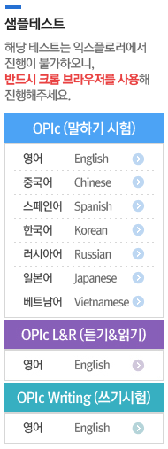

# Index
1. [TEPS](https://github.com/msjun23/TEPS-OPIc-Strategy#teps-strategy)
2. [OPIc](https://github.com/msjun23/TEPS-OPIc-Strategy#opic-strategy)

---

# TEPS-Strategy
Personal TEPS strategy

**Info at this page is guarantee nothing.** Information about TEPS is based on [official TEPS site](https://www.teps.or.kr/) and some strategy or tip is from google search.

## New TEPS 시험구성 및 유형설명

 

## Reading Comprehension 문제풀이 순서

> ### 35문항, 240점, 40분
>
> 1. **Part 3 -> 13~16번** 
>   |__ 토픽 맞추기, 5분
> 2. **Part 3 -> 17~23번** 
>   |__ 맞는 내용 맞추기, 10분
> 3. **Part 2 -> 11~12번** 
>   |__ 문맥상 어색한 내용 고르기, 2분
> 4. **Part 4 -> 26~33번** 
>   |__ 1지문 2문제(시간 오래 걸림, 어쨋든 시간 여유 있을 때 풀어둘 것), 10분
> 5. **Part 1 -> 1~10번** 
>   |__ 9, 10번(접속사 문제) -> 1~6번 -> 7,8번(시간 남으면)
> 6. **24, 25 / 34, 35 풀지 말 것**

---

# OPIc-Strategy
Personal OPIc strategy

## Sample Test

Sample test is available at [here](https://www.opic.or.kr/opics/servlet/controller.opic.site.receipt.ExamReceiptServlet?p_process=select-list&p_nav=1_1)

The total number of questions is 15. Five categories, for one category, 3 questions. Nine questions about three categories are selected from my survey and the others, six questions, are random.

## Background Survey
> Part 1 of 4: 현재 귀하는 어느 분야에 종사하고 계십니까?
>> **일 경험 없음**
>
> Part 2 of 4: 현재 당신은 학생입니까?
>> **예** (<- 주관적 선택, 보통 학생 아님을 추천하는데 개인적으로 이게 더 편할 것 같음)
>>
>> 추가 질문: 현재 어떤 강의를 듣고 있습니까?
>>> **학위 과정 수업**
>
> Part 3 of 4: 현재 귀하는 어디에 살고 계십니까?
>> **가족(배우자/자녀/기타 가족 일원)과 함께 주택이나 아파트에 거주**
>
> Part 4 of 4: 아래의 설문에서 총 12개 이상의 항목을 선택하십시오
>> 귀하는 여가 활동으로 주로 무엇을 하십니까? (두 개 이상 선택)
>>> **영화보기, 공연보기, 콘서트보기**
>>>
>>> **공원가기, 해변가기**
>>>
>>> **주거 개선**
>>
>> 귀하의 취미나 관심사는 무엇입니까? (한 개 이상 선택)
>>> **요리하기**
>>
>> 귀하는 주로 어떤 운동을 즐기십니까? (한 개 이상 선택)
>>> **자전거, 조깅, 걷기, 하이킹/트래킹**
>>
>> 귀하는 어떤 휴가나 출장을 다녀온 경험이 있습니까? (한 개 이상 선택)
>>> **집에서 보내는 휴가**
>>>
>>> 대체항목 -> 국내 여행, 해외 여행

## Self Assessment
One to six level and checking high level gets **advantage**, but question quality is more complex.
> IM2 -> 3
>
> IM3 -> 4
>
> IH, AL -> 5

